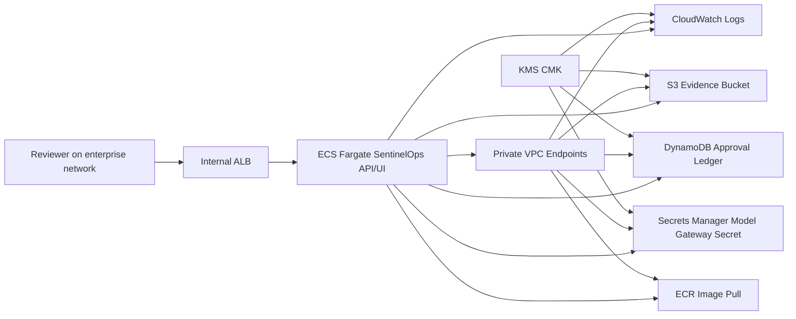

# SentinelOps AI GovCloud Deployment Architecture

## Purpose

This deployment plan shows how the local SentinelOps AI proof-of-work can move into a controlled AWS GovCloud pilot without weakening the approval, eval, and evidence boundaries already implemented in the app.

## Target Shape

## Network Boundary

- ECS tasks run in private subnets with `assign_public_ip = false`.
- The load balancer is internal only and accepts traffic from configured enterprise CIDR blocks.
- AWS service access uses private VPC endpoints instead of a public NAT path.
- The task security group accepts application traffic only from the internal ALB security group.
- The endpoint security group accepts HTTPS only from the task security group.

## Runtime Boundary

- The single Node service serves both the React dashboard and `/api/*`.
- The default deployment mode remains `deterministic-local` until model gateway credentials and egress controls are approved.
- The container image is expected to be pushed to a GovCloud ECR repository with immutable tags and scan-on-push enabled.
- The server uses a pluggable persistence adapter. Local demos use JSON; GovCloud pilots set `SENTINELOPS_STORAGE_ADAPTER=aws` to store the state snapshot and evidence packets in S3 while mirroring signed approval records to DynamoDB.
- Hosted identity uses `SENTINELOPS_AUTH_MODE=oidc` with a GovCloud-appropriate identity provider JWKS URL, expected issuer, expected audience, and group-to-role mapping.
- `server/policies/policy-as-code.json` defines the private networking, internal ALB, VPC endpoint, encryption, recoverability, and runtime-mutation controls expected from this Terraform skeleton.
- Evidence handoff uses `GET /api/runs/:id/evidence-bundle` to pair the Markdown packet with SHA-256 packet, section, and manifest hashes plus approval-ledger verification.

## Data Boundary

- The pilot stores no classified data and should use synthetic or cleared demonstration payloads only.
- Evidence exports are encrypted with a KMS CMK and versioned in S3.
- Approval records are intended for DynamoDB with point-in-time recovery.
- Model gateway credentials must be written to Secrets Manager out of band and never committed to Terraform state.

## Deployment Flow

1. Build and test the app locally with `npm run build`, `npm run evals:local`, `npm run policy:check`, `npm run audit:check`, `npm run smoke:api`, and `npm run smoke:rbac`.
2. Build the Docker image from the repository root.
3. Push the image to the GovCloud ECR repository created by Terraform.
4. Plan the Terraform module with an internal CIDR allowlist and optional ACM certificate ARN.
5. Apply in a controlled sandbox account.
6. Verify `/api/health`, Settings role catalog, storage mode, Evals `6/6 passed`, and evidence export.
7. Keep live model mode disabled until the model gateway and egress review are complete.

## Production Gaps

- Configure the production identity provider, JWKS key-rotation expectations, and enterprise group lifecycle.
- Add OPA/Rego compatibility if enterprise policy libraries need to be imported.
- Add centralized audit export packaging for security review.
- Add managed tracing and alert routing for approval, eval, and evidence failures.
